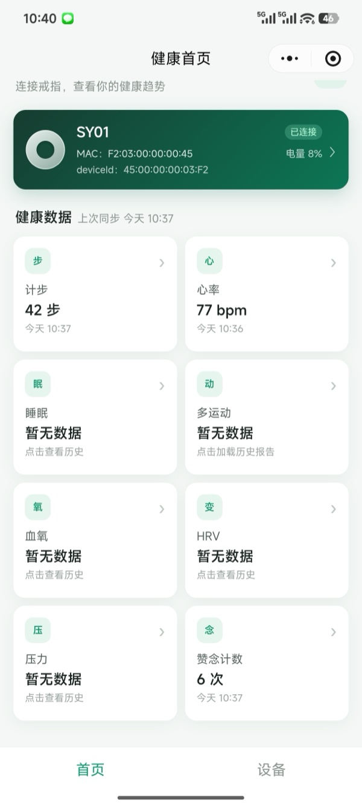
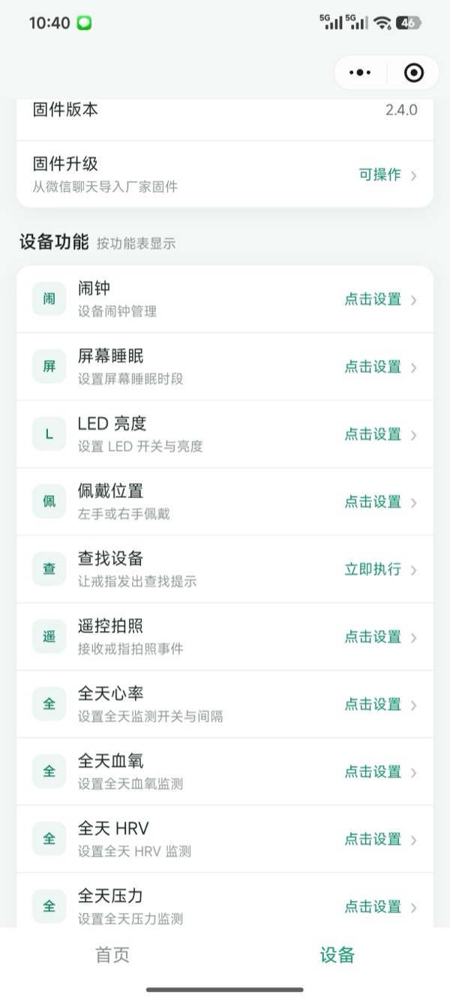

# RW BLE 微信小程序 SDK

RW BLE 微信小程序 SDK 用于搜索、连接 RW 智能戒指，并提供设备设置、健康数据同步、实时检测、多运动、传感器数据和 OTA 等能力。

当前版本：`RW_SDK_V2.0.0_20260806`

## 效果展示

<table>
  <tr>
    <td width="50%" align="center"><b>首页 · 健康概览</b></td>
    <td width="50%" align="center"><b>设备 · 功能设置</b></td>
  </tr>
  <tr>
    <td width="50%" align="center"></td>
    <td width="50%" align="center"></td>
  </tr>
  <tr>
    <td width="50%" align="center">绑定设备状态、电量与当日健康数据卡片，点击进入历史详情与实时检测。</td>
    <td width="50%" align="center">按设备功能表动态展示可设置项：闹钟、屏幕、LED、佩戴手、全天监测间隔、查找 / 拍照等。</td>
  </tr>
</table>

## 仓库内容

| 目录 | 说明 |
| --- | --- |
| `RW_SDK_DEMO/` | 可直接导入微信开发者工具的完整示例工程 |
| `RW_SDK_DEMO/sdk/rw-ble-sdk.min.js` | 单文件 CommonJS SDK 发布件 |
| `RW_SDK_DEMO/sdk/index.d.ts` | 合并后的完整 TypeScript 公开类型声明 |
| `doc/` | SDK 中文集成文档（`blesdkwechat_zh.md`）与 Demo 截图（`screenshots/`） |

## 快速开始

1. 使用微信开发者工具导入 `RW_SDK_DEMO`。
2. 仓库保留了用于内部测试的 AppID 和开发者工具私有配置；外部接入方发布前需换成自己的小程序 AppID。
3. 使用微信真机进行蓝牙搜索、连接和数据同步测试；开发者工具模拟器不支持完整 BLE 流程。
4. 集成到自有工程时，将 `RW_SDK_DEMO/sdk/` 完整复制到小程序目录，并参考 [微信小程序 SDK 使用说明](doc/blesdkwechat_zh.md)。

Demo 设备页含固件升级入口，支持导入固件包完成升级，升级前会自动校验固件适用的设备型号。

Demo 只通过单个 CommonJS 入口加载 SDK：

```js
const { RingSdk } = require("../sdk/rw-ble-sdk.min.js");
```

请同时保留 `rw-ble-sdk.min.js` 和 `index.d.ts`；正式发布前请在微信开发者工具及真机上完成验证。

## 平台说明

- iOS 的 `deviceId` 不是 BLE MAC；Demo 会同时展示并保存广播包解析出的 MAC 和微信返回的 `deviceId`。
- iOS 系统当前保持连接的设备会一同显示在搜索列表顶部。
- BLE、ANCS 和 OTA 行为必须在目标手机及真实设备上验收。

## 技术支持

请联系业务人员或发送邮件至 [developer@dhouse88.com](mailto:developer@dhouse88.com)。
